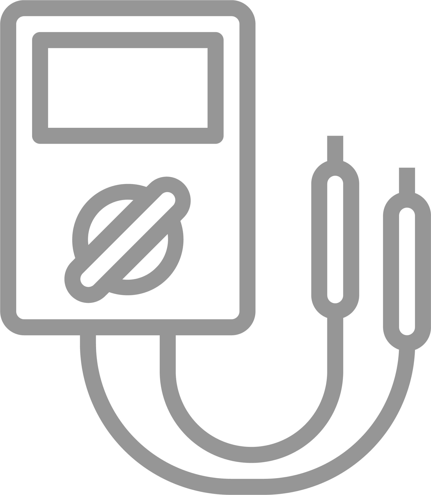
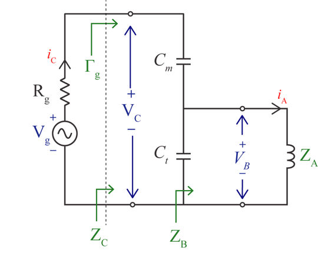

<!-- PROJECT LOGO -->
 

  
 

<h3 align="center">Tune & Match Circuit Analysis</h3>

<!-- ABOUT THE PROJECT -->
## **About the project**
The script computes the the transformation of 1V incduced by a:

* locally tuned and matched reciever across a 50 ohm receiver terminal.
* A 50 ohm reciever (geneartor) across the terminals of a locally tuned and matched coil.

### Software
* MATLAB 
***

 
  
 

**Computation**

Complex coil impedance is defined as:

The tuning (Ct) and matching (Cm) element values are found by solving the matching conditions

Ct and Cm values are only valid when B and X are positive, therefore an appropriate sign is to be chosen in for the Ct equation. Subsequently, the input impedance of the parallel LC resonant circuit is defined as:

**Voltage and current distribution (Generator POV)**

The reflection coefficient looking through the generator terminals (Gen->Load)

The accepted power by the circuit from the generator is computed as

As such the voltage induced across the generator terminals and current flowing through them are

Similallry the voltage induced across the parallel resonator is

The current flowing through the coil is evaluated by

Therefore the power delivered to the coil is

(<a href="#top">back to top</a>)

***
<!-- Results -->
## Results
 
  
 

<!-- LICENSE -->
## License

Distributed under the MIT License. See `LICENSE.txt` for more information.

<!-- CONTACT -->
## Contact

Mohammed M. Albannay - [@Bannay](https://twitter.com/bannay) - bannay@gmail.com

Project Link: [https://github.com/bannay/rigid-surfacecoil](https://github.com/bannay/rigid-surfacecoil)

<!-- ACKNOWLEDGMENTS -->
## Acknowledgments

* [Readme template](https://github.com/othneildrew/Best-README-Template)

(<a href="#top">back to top</a>)

***
