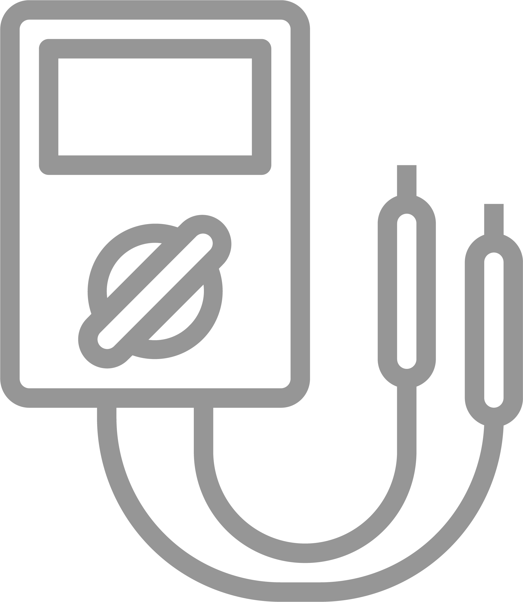
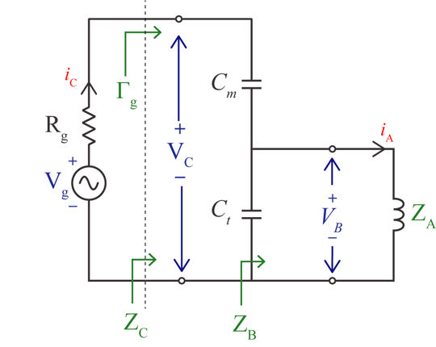
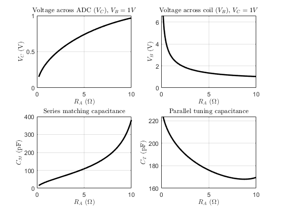

<!-- PROJECT LOGO -->
 

  
 

<h3 align="center">Tune & Match Circuit Analysis</h3>

<!-- ABOUT THE PROJECT -->
## **About the project**
The script computes the the transformation of 1V incduced by a:

* locally tuned and matched reciever across a 50 ohm receiver terminal.
* A 50 ohm reciever (geneartor) across the terminals of a locally tuned and matched coil.

### Software
* MATLAB 
***

 
  
 

## Computation

Complex coil impedance is defined as:

$$
Z_A = R_A + jX_A
$$

The tuning ($C_t$) and matching ($C_m$) element values are found by solving the matching conditions:

$$
B = \frac{X_A \pm \sqrt{\frac{R_A}{Z_0}} \cdot \sqrt{R_A(R_A - Z_0) + X_A^2}}{R_A^2 + X_A^2}
$$

$$
C_t = \frac{B}{\omega_0}
$$

$$
Z_B = \frac{1}{j\omega C_t + \frac{1}{Z_A}}
$$

$$
X = \frac{1}{B} + \frac{X_A Z_0}{R_A} - \frac{Z_0}{R_A B}
$$

$$
C_m = \frac{-1}{\omega X}
$$

$C_t$ and $C_m$ values are only valid when $B$ and $X$ are positive, so the sign in the $C_t$ equation must be chosen accordingly.

The input impedance of the parallel LC resonant circuit is:

$$
Z_C = Z_B - \frac{j}{\omega C_m}
$$

### Voltage and Current Distribution (Generator POV)

The reflection coefficient from the generator terminals:

$$
\Gamma_G = \frac{Z_C - Z_0}{Z_C + Z_0}
$$

The accepted power by the circuit:

$$
P_{in} = P_{av} \left(1 - |\Gamma_G|^2\right)
$$

Voltage across the generator terminals:

$$
V_C = \sqrt{4 P_{in} Z_C}
$$

Current through the generator terminals:

$$
i_C = \frac{V_C}{Z_C}
$$

Voltage across the parallel resonator:

$$
V_B = V_C \cdot \frac{Z_B}{Z_B + jX}
$$

Current through the coil:

$$
i_A = \frac{V_B}{Z_A}
$$

Power delivered to the coil:

$$
P_L = \frac{1}{2} \, \Re \left(i_A^* V_B\right)
$$

(<a href="#top">back to top</a>)

***
<!-- Results -->
## Results
 
  
 

<!-- LICENSE -->
## License

Distributed under the MIT License. See `LICENSE.txt` for more information.

Project Link: [https://github.com/bannay/tmc-analysis](https://github.com/bannay/tmc-analysis)

<!-- ACKNOWLEDGMENTS -->
## Acknowledgments

* [Readme template](https://github.com/othneildrew/Best-README-Template)

(<a href="#top">back to top</a>)

***
